## Intro and motivation

In this post I would like to describe in detail our setup and development environment (hardware & software) and how to get it, step by step.

I have been using this setup for more than 5 years with little changes (mainly hardware improvements), in many companies, and helped me in the development of dozens of Data projects. Never missed a single feature while using it. This is the standard setup both [Pedro](https://es.linkedin.com/in/pedro-munoz-botas) and [me](https://www.linkedin.com/in/davidadrian/) use at [WhiteBox](https://whiteboxml.com/).

Why this guide? Over time, we found many students and fellow Data Scientists looking for a solid environment with some fundamental features:

- Standard Data Science tools like Python, R, and its libraries are easy to install and maintain.
- Most libraries just work out of the box with little extra configuration.
- Allows to cover the full spectrum of Data related tasks, from Small to Big Data, and from standard Machine Learning models to Deep Learning prototyping.
- Do not need to break your bank account to buy expensive hardware and software.

## Hardware

Your laptop should have:

- At least 16GB of RAM. This is the most important feature as it will limit the amount of data you can easily process in memory (without using tools like Dask or Spark). The more the better. Go with 32GB if you can afford it.
- A powerful processor. At least an Intel i5 or i7 with 4 cores. It will save you a lot of time while processing data for obvious reasons.
- A NVIDIA GPU of at least 4GB of RAM. Only if you need to prototype or fine-tune simple Deep Learning models. It will be orders of magnitude faster than almost any CPU for that task. **Remember that you can't train serious Deep Learning models from scratch in a laptop**.
- A good cooling system. You are going to run workloads for at least hours. Make sure your laptop can handle it without melting.
- A SSD of at least 256GB should be enough.
- Possibility to upgrade its capabilities, like adding a bigger SSD, more RAM, or easily replace battery.

My personal recommendation is getting a second hand Thinkpad workstation laptop. I have an second hand [P50](https://www.lenovo.com/us/en/laptops/thinkpad/thinkpad-p/ThinkPad-P50/p/22TP2WPWP50) I bought for 500€ which meets all features listed above:

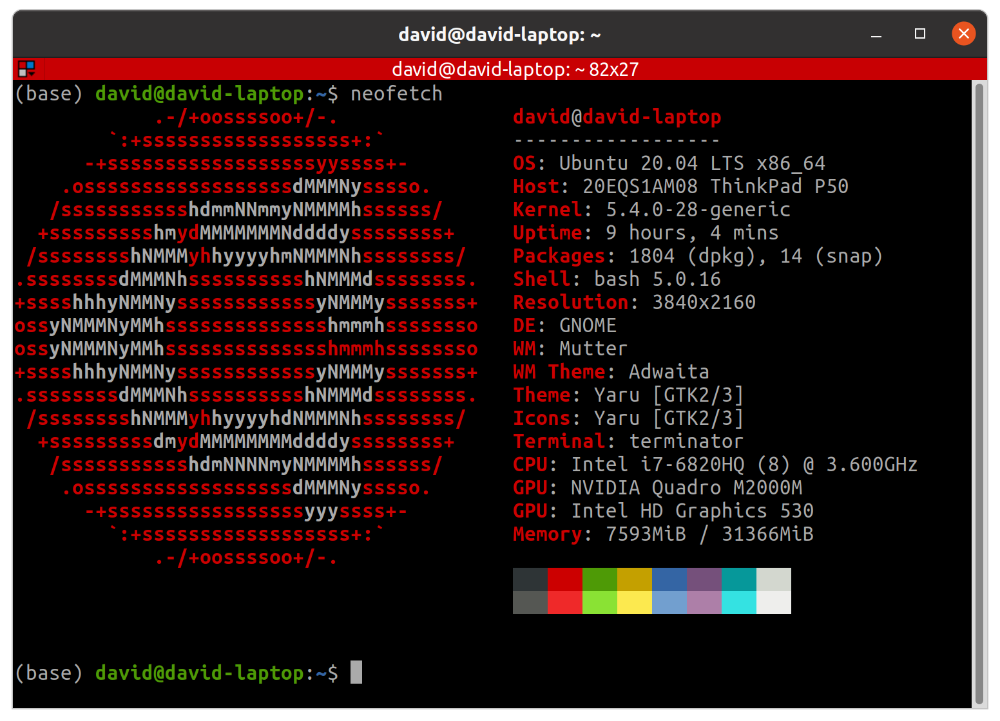

Thinkpads are excellent professional laptops we have been using for years and never failed us. Its handicap is the price, but you can find lots of second hand Thinkpads in very good using conditions as many big corporations have leasing agreements and dispose laptops every 2 years. Many of these laptops end in the second hand market. You can start your search in:

- [https://www.backmarket.com/](https://www.backmarket.com/)
- [https://es.wallapop.com/](https://es.wallapop.com/)
- [https://www.ebay.com/](https://www.ebay.com/)
- [https://cashconverters.com/](https://cashconverters.es/)

Many of these second hand markets can provide warranty and an invoice (in case you are a company). If you are reading this post and belong to a middle to big sized organization, the best option for you is probably reaching a leasing agreement directly with the manufacturer.


**Avoid**:

- Apple MacBooks: for a variety of reasons, you should avoid an Apple laptops unless you really (and I mean, really) love OSX. They are **intended for professionals from the design field and music producers**, like photographers, video and photo editors, UX/UI, and even developers who don't need to run heavy workloads, like Web Developers. My main laptop from 2011 to 2016 was a MacBook, so I know its limitations very well. Main reasons not to buy one are:
    - You are going to pay much more for the same hardware.
    - You will suffer a terrible vendor lock-in, which means a huge cost to change to other alternative.
    - You can't have a NVIDIA GPU, so forget about Deep Learning prototyping in your laptop.
    - Can not upgrade its hardware as it is soldered to the motherboard. In case you need more RAM, you have to buy a new laptop.
- Ultrabooks (in general): most ultrabooks are designed for light workloads, web browsing, office productivity software and similar. Most of them does not meet the cooling system requirement listed above, and its life will be short. They are also not upgradable.

## Operating System

Our go-to operating system for Data Science is the latest LTS (Long Term Support) of Ubuntu. At the time of writing this post, [Ubuntu 20.04 LTS](https://releases.ubuntu.com/20.04/) is the latest.

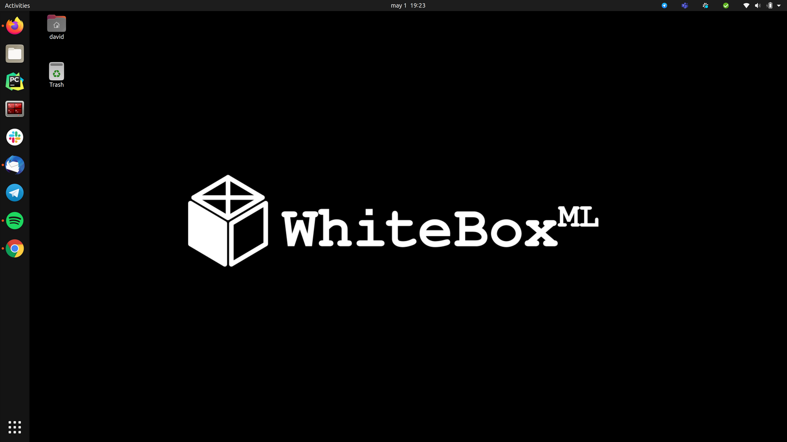

Ubuntu offers some advantages over other operating systems and other Linux distros for you as a Data Scientist:

- Most successful Data Science tools are open-source and are easy to install and use in Ubuntu, which is also free an open-source. It makes sense as most developers of those tools are probably using Linux. It is specially true when it comes to Deep Learning frameworks with GPU support, like TensorFlow, PyTorch, etc.
- As you are going to be working with Data, security must be at the core of your setup. Linux is by default, more secure than Windows or OS X, and as it is used by a minority of people, most malicious software is not designed to run on Linux.
- It is the most used Linux distro, both for desktops and servers, with a great and supportive community. When you find something is not working well, it will be easier to get help or find info about how to fix it.
- [Most servers are Linux based](https://www.wired.com/2016/08/linux-took-web-now-taking-world/), and you probably want to deploy your code in those servers. The closer you are to the environment you are going to deploy to production, the better. This is one of the main reasons to use Linux as your platform.
- It has a great [package manager](http://manpages.ubuntu.com/manpages/focal/man8/aptitude-curses.8.html) you can use to install almost everything.

**Some caveats to install Ubuntu:**

- If you are lucky enough to have a dedicated GPU, do not install proprietary drivers for graphics (unchecked box while installation). You can install later as default drivers are buggy and may cause external monitors to not work properly for certain GPU's (like in my case):

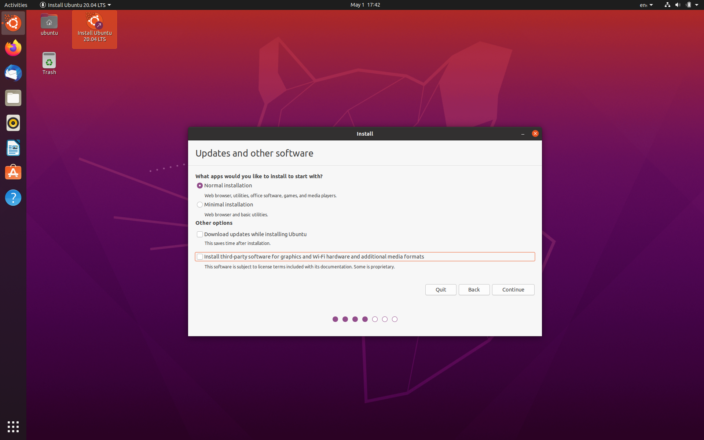

- Create your installation USB properly, if you have access to Linux, can use [Startup Disk Creator](https://launchpad.net/usb-creator), for Windows or OSX, [balenaEtcher](https://www.balena.io/etcher/) is a solid choice.

## NVIDIA Drivers

NVIDIA Linux support has been one of the complaints of the community for years. Remember that famous:

> **NVIDIA**: FUCK YOU!

<figure>

<figcaption>Linus Torvalds talking about NVIDIA</figcaption>
</figure>

Luckily, things have changed and now, although still a pain in the ass sometimes, everything is easier.

**This is how you must install NVIDIA drivers:**

1. Add [proprietary GPU drivers PPA](https://launchpad.net/~graphics-drivers/+archive/ubuntu/ppa) to your system:

```bash
sudo add-apt-repository ppa:graphics-drivers/ppa
```

2. Install latest available drivers (440 at the time of writing this post, use `TAB` key to check for available options):

```bash
sudo apt install nvidia-driver-440
```

Wait for the installation to finish and reboot your PC.

You should be able now to access NVIDIA X Server Settings:

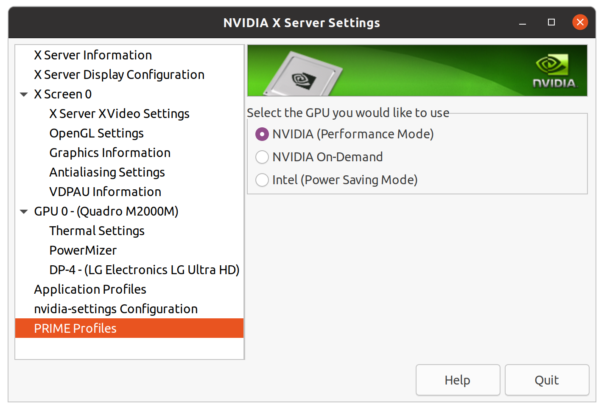

You can use this to switch between Power Saving Mode (useful if you are not going to do any Deep Learning Stuff) and Performance Mode (allows you to use GPU, but drains your battery). Avoid On-Demand mode as it is still not working properly.

You should also be able to run `nvidia-smi` application, which displays information about GPU workloads (usage, temperature, memory). You are going to use it a lot while training Deep Learning models on GPU.

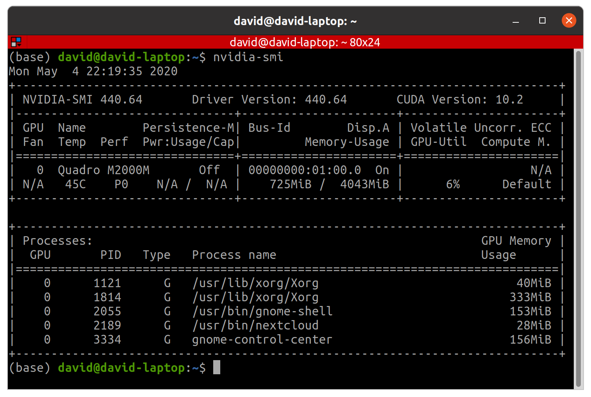

## Terminal

While default GNOME Terminal is OK, I prefer using [Terminator](https://terminator-gtk3.readthedocs.io/en/latest/#), a powerful terminal emulator which allows you to split the terminal window vertically `ctr` + `shift` + `e` and horizontally `ctr` + `shift` + `o`, as well as broadcasting commands to several terminals at the same time. This is useful to setup various servers or a cluster.

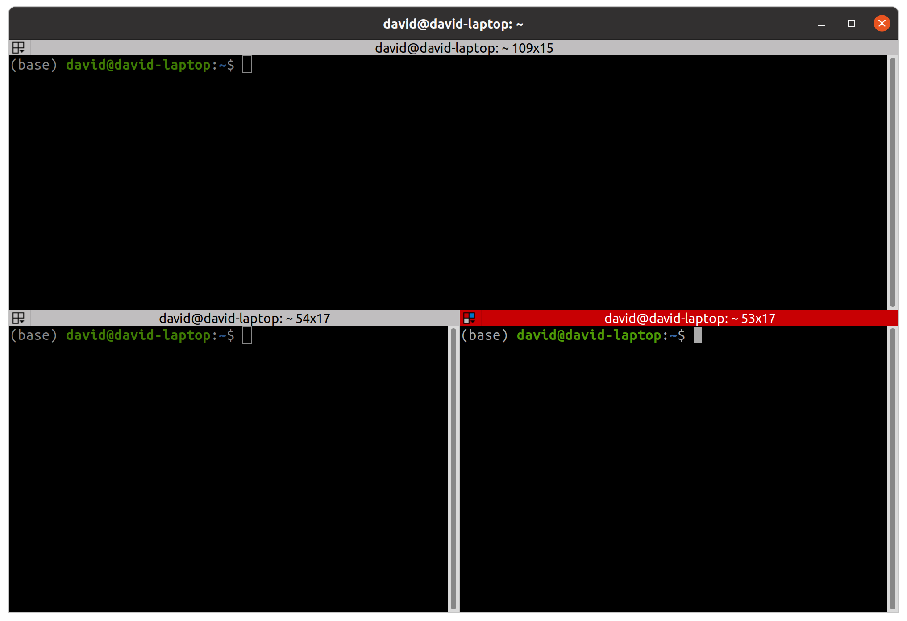

Install Terminator like this:

```bash
sudo apt install terminator
```

## VirtualBox

VirtualBox is a software that allows you to run _virtually_ other machines inside your current operating system session. You can also run different operating systems (Windows inside Linux, or the other way around).

It is useful in case you need a specific software which is not available for Linux, like BI and Dashboarding tools like:

- Microsoft PowerBI
- Tableau
- Spotfire

VirtualBox is also useful to test new libraries and software without compromising your system, as you can just create a VM (Virtual Machine), test whatever you need and delete it.

To install VirtualBox, open your terminal and write:

```bash
sudo apt install virtualbox
```

Although its usage is fairly simple, it is hard to master. For an extensive tutorial of VirtualBox, check [this](https://www.virtualbox.org/manual/ch01.html).

## Python, R and more (with Miniconda)

Python is already included with Ubuntu. But you **should never use system Python or install your analytics libraries system-wide**. You can break system Python doing that, and fixing it is hard.

I prefer creating isolated virtual environments I can just delete and create again in case something goes wrong. The best tool you can use to do that is [conda](https://docs.conda.io/en/latest/):

> _Package, dependency and environment management for any language—Python, R, Ruby, Lua, Scala, Java, JavaScript, C/ C++, FORTRAN, and more._

Although many people uses conda, few people really understand how it works and what it does. It may lead to frustration.

conda is shipped in two flavors:

- Anaconda: includes conda package manager **and** a lot of libraries (500Mb) installed. You are not going to use all those libraries and moreover will be outdated in a few days. I do not recommend going with this flavor.
- Miniconda: includes just conda package manager. You still have access to all existing libraries through conda or pip, but those libraries will be downloaded and installed when they are needed. Go with this option, as it will save you time and memory.

Download Miniconda install script from [here](https://repo.anaconda.com/miniconda/Miniconda3-latest-Linux-x86_64.sh) and run it:

```bash
bash Miniconda3-latest-Linux-x86_64.sh
```

Make sure you initialize conda (so answer `yes` when install script asks!) and those lines are added to your `.bashrc` file:

```bash
# >>> conda initialize >>>
# !! Contents within this block are managed by 'conda init' !!
__conda_setup="$('/home/david/miniconda3/bin/conda' 'shell.bash' 'hook' 2> /dev/null)"
if [ $? -eq 0 ]; then
    eval "$__conda_setup"
else
    if [ -f "/home/david/miniconda3/etc/profile.d/conda.sh" ]; then
        . "/home/david/miniconda3/etc/profile.d/conda.sh"
    else
        export PATH="/home/david/miniconda3/bin:$PATH"
    fi
fi
unset __conda_setup
# <<< conda initialize <<<
```

This will add the conda app to your `PATH` so you can access it anytime. To check conda is properly installed, just type `conda` in your terminal:

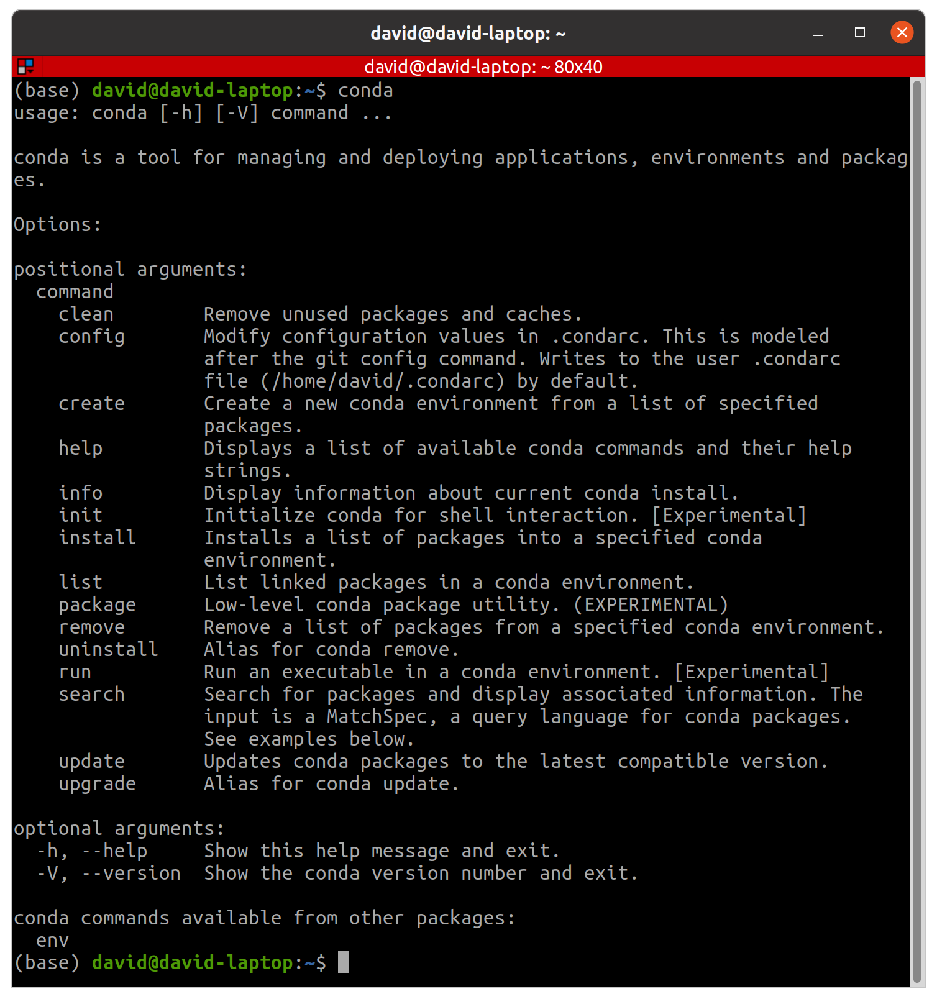

Remember that in a conda virtual environment you can install whatever Python version you want, as well as R, Java, Julia, Scala, and more...

Remember that you can also install libraries from both conda and pip package managers and don't have to choose one of them as they are perfectly compatible in the same virtual environment.

**One more thing about conda:**

conda offers a unique feature for deploying your code. It is a library called `conda-pack` and it is a **must** for us. It helped us many times to get our libraries deployed in internet isolated clusters with no access to `pip`, no `python3` and no simple way to install anything you need.

This library allows you to create a `.tar.gz` file with your environment you can just uncompress wherever you want. Then you can just activate the environment and use it as usual.

To install and use `conda-pack` visit this [link](https://conda.github.io/conda-pack/):

```bash
conda install -c conda-forge conda-pack
```

This is the ultimate weapon against lazy IT guys who don't give you the right permissions to work in a given environment and don't have time to configure it to suit your project needs. Have ssh access to a server? Then you have the environment you want and need.

Here is a demo from official documentation:

## Jupyter

Jupyter is a must for a Data Scientist, for developments where you need an interactive programming environment.

A trick I learned over the years is to create a local JupyterHub server and configure as a system service so I don't have to launch the server every time (it is always up and waiting as soon as the laptop starts). I also install a library that detects Python/R kernels in all my environments and automatically make them available in Jupyter.

To do this:

1. First create a conda virtual environment (I usually call it `jupyter_env`):

```bash
conda create -n jupyter_env
```

2. Activate the environment:

```bash
conda activate jupyter_env
```

3. Install Python:

```bash
conda install python=3.7
```

4. Install needed libraries:

```bash
conda install -c conda-forge jupyterhub jupyterlab nodejs nb_conda_kernels
```

5. Create a service file `sudo nano /etc/systemd/system/jupyterhub.service` with the content (adapt paths, changing `<your_user>` with your user name):

```ini
[Unit]
Description=JupyterHub
After=network.target

[Service]
User=root
Environment="PATH=/bin:/usr/local/sbin:/usr/local/bin:/usr/sbin:/usr/bin:/home/<your_user>/miniconda3/envs/jupyter_env/bin:/home/<your_user>/miniconda3/bin"
ExecStart=/home/<your_user>/miniconda3/envs/jupyter_env/bin/jupyterhub

[Install]
WantedBy=multi-user.target
```

6. Reload the service daemon:

```bash
sudo systemctl daemon-reload
```

7. Start `jupyterhub` service:

```bash
sudo systemctl start jupyterhub
```

8. Enable `jupyterhub` service, so it starts automatically at boot time:

```bash
sudo systemctl enable jupyterhub
```

9. Now you can go to `localhost:8000` and login **with your Linux user and password**:

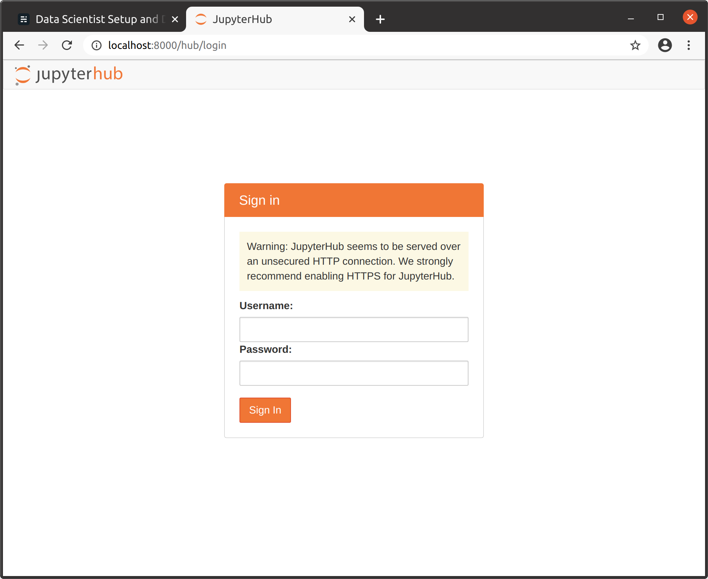

10. After login you have access to a fully fledged Jupyter server at classic mode (`/tree`) or the more recent JupyterLab (`/lab`):

")

")

The most interesting feature of this Jupyter setup is that it detects kernels in all conda environments, so you can access those kernels from here with no hassle. Just install the corresponding kernel **in the desired environment** (`conda install ipykernel`, or `conda install irkernel`) and restart Jupyter server from JupyterHub control panel:

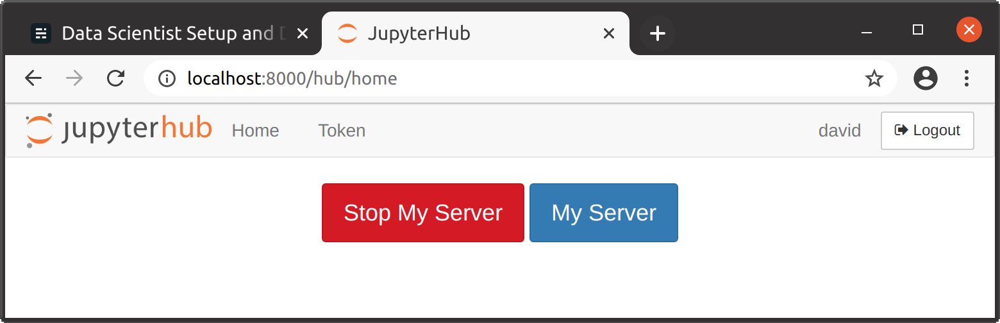

Remember to previously activate the environment where you want to install the kernel! (`conda activate <env_name>`).

## IDEs

#### Python

Python is our primary language at [WhiteBox](https://whiteboxml.com/).

As you probably know I am a supporter of [FOSS](https://en.wikipedia.org/wiki/Free_and_open-source_software) solutions, specially in the Data ecosystem. One of the few **proprietary** software I am going to recommend here, is the one we use as [IDE](https://en.wikipedia.org/wiki/Integrated_development_environment): [PyCharm](https://www.jetbrains.com/pycharm/). If you are serious about your code, you want to use an IDE like PyCharm:

- Code completion and environment introspection.
- Python environments, including native conda support.
- Debugger.
- Docker integration.
- Git integration.
- Scientific mode (pandas DataFrame and NumPy arrays inspection).

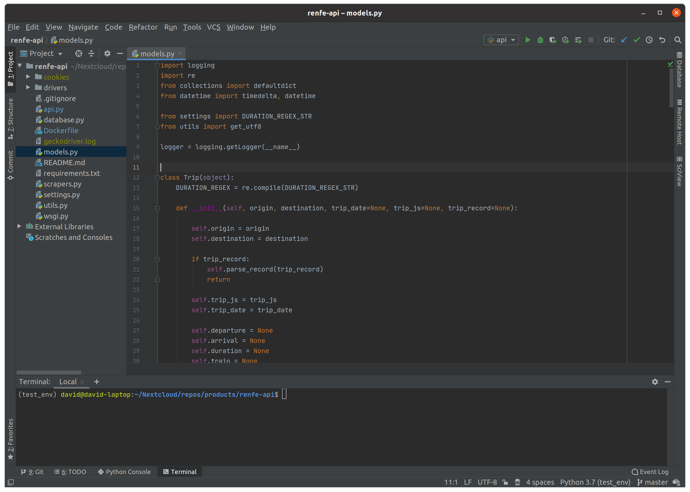

Other popular choices does not have the stability and features of Pycharm:

- Visual Studio Code: is more a Text Editor than an IDE. I know you can extend it using plugins, but is not as powerful as PyCharm. If you are a Web Dev with projects in multiple languages, Visual Studio Code may be a good choice for you. If you are a Web Developer and Python is your language of choice for back-end, go with Pycharm even if you are not in Data.
- Jupyter: if you have doubts about when you should be using Jupyter or PyCharm and call yourself a Data <whatever>, please attend [one of the bootcamps](https://www.ironhack.com/en/data-analytics) we teach asap.

Our advice for installing PyCharm is using [Snap](https://en.wikipedia.org/wiki/Snap_\(package_manager\)), so your installation will be automatically updated and isolated from the rest of the system. For community (free) version:

```bash
sudo snap install pycharm-community --classic
```

### Scala

Scala is a language we use for Big Data projects with native Spark, although we are shifting to PySpark.

Our recommendation here is [IntelliJ IDEA](https://www.jetbrains.com/idea/). It is an IDE for JVM based languages (Java, Kotlin, Groovy, Scala) from PyCharm developers (JetBrains). It best feature is its native support for Scala and its similarities to PyCharm. If you came from Eclipse, can adapt key bindings and shortcuts to replicate Eclipse ones.

To install community (free) version:

```bash
sudo snap install intellij-idea-community --classic
```

## Big Data

Okay, you are not going to really do Big Data in your laptop. In case you are in a Big Data project, your company or client is going to provide you with a proper Hadoop cluster.

But there are situations where you may want to analyze or make a model with data that doesn't fit easily in your laptop memory. In those cases, a local Spark installation is very helpful. Using my humble laptop, I have crushed datasets sized GB on disk, which on memory translates in much more.

This is our recommendation to get Spark up and running in your laptop:

1. Create or activate a conda environment.

2. Install PySpark and OpenJDK:

```bash
conda install pyspark openjdk
```

3. Use your local spark:

```python
from pyspark.sql import SparkSession

spark = SparkSession.builder. \
	appName('your_app_name'). \
	config('spark.sql.session.timeZone', 'UTC'). \
	config('spark.driver.memory', '16G'). \
	config('spark.driver.maxResultSize', '2G'). \
	getOrCreate()
```

Honorable mentions here are:

- [Dask](https://dask.org/): simplifying things a lot, Dask is some kind of native Spark for Python. It is closer to pandas and NumPy APIs, but in our experience, it is not as robust as Spark by far. We use it from time to time.
- [Modin](https://modin.readthedocs.io/en/latest/): replicates pandas API with support for multi-core and out-of-core computations. It is specially useful when you are working in a powerful analytics server with lots of cores (32, 64) and want to use pandas. As per-core performance is usually poor, Modin will allow you to speed your computation.

## Database Tools

Sometimes you need a tool able to connect with a variety of different DB technologies, make queries and explore data. Our choice is [DBeaver](https://dbeaver.io/):

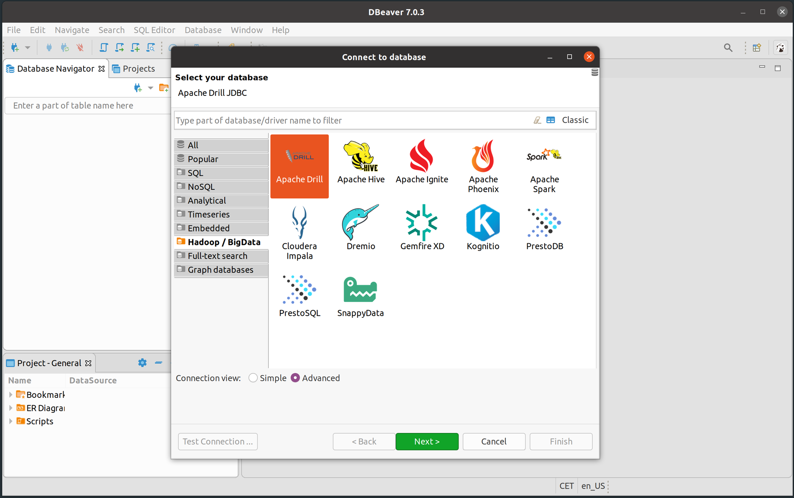

DBeaver is a tool that automatically downloads drivers for lots of different databases. It supports:

- Database, schema, table and column name completion.
- Advanced networking requirements to connect, like SSH tunnels and more.

You can install DBeaver like this:

```bash
sudo snap install dbeaver-ce
```

Honorable mention:

- [DataGrip](https://www.jetbrains.com/datagrip/): a database IDE by JetBrains we use sometimes, very similar to DBeaver, with less technologies supported, but very stable: `sudo snap install datagrip --classic`

## Others

Other specific tools and apps that are important for us are:

- Spotify: `sudo snap install spotify`.
- Slack: `sudo snap install slack --classic`.
- Telegram Desktop: `sudo snap install telegram-desktop`.
- Nextcloud: `sudo apt install nextcloud-desktop nautilus-nextcloud`.
- Thunderbird Mail: installed by default.
- Zoom: download manually from [here](https://zoom.us/download).
- Google Chrome: download manually from [here](https://www.google.com/intl/en_us/chrome/).

And this is all. Those are a lot of tools and we probably forgot something. In case you miss some category here or need some advice, leave a comment and we will try to extend the post.
