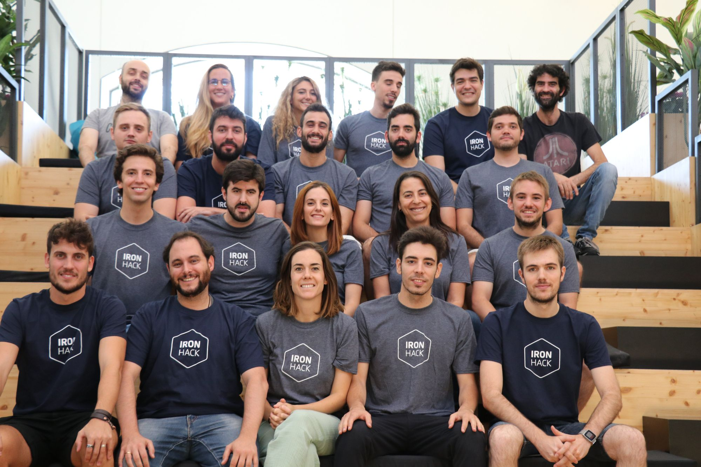

## How and Why we got involved

**We strongly defend never spending more than 50% of time teaching** because it “steals” time to work on our projects (main consultancy job, products, etc.) or study/learn new technology ourselves. At first, when [Ironhack](https://www.ironhack.com) (a  Global Digital School with headquarters in Madrid) proposed us to join their teaching stuff, we were very skeptical  about it.

At that point, in the middle of 2019 summer we were very busy with:

-   Our full time job as Data Scientists.
-   Our personal projects and [products](https://whiteboxml.com).

At the same time we had (and still have) a strong feeling that many things in the Data Science ecosystem are  **wrong** and the cause of that was, in part, how the Data workforce was growing in a fairly fast and chaotic way  due to the high demand of Data profiles across all industries. Newcomers usually lack important knowledge about Data  Science principles and that causes frustration to them and important loses to their employers. For us, the opportunity  of **teaching the next generation of Data Scientists was very attractive** as it allows us to implement and extend our vision  about how Data Science should be done.

## Bootcamps

There are variety of opinions about Bootcamps with equal number of  defenders and detractors. For us the most important thing when it comes to teaching Data Science is the following:

**Focusing on the most important things**: you do not need to have a PhD to be a Data Scientist neither an statistician  nor a Software Engineer. Most of the work of a Junior Data Scientist (maybe 70%) can be effectively learned with a  Bootcamp approach in 8/9 weeks, taking into account that every company has its own traits and there is nothing like  instant delivery when hiring a Data Scientist as some adaptation time is needed for both Junior and Senior positions.

**Teaching “Real World” skills**: I would like to put some emphasis in the “Real World” part. There are tons of courses about Data Science and there is not a consensus about the perfect curriculum for a fully comprehensive course but I think we got very close to that at IronHack. A Junior Data Scientist ready for deployment should know:

-   How to **crush data**.
-   How to explain gained insights using visualizations, reports, dashboards, etc.
-   How to **craft simple models** (we are not talking about hybrid Deep Learning architectures here).
-   How to effectively **put those models into production** and generate value for a company.

The rest of the skills comes with experience, right coaching from more senior colleagues and managers, etc. We focus on teaching and reinforcing those skills that are going to be used repeatedly over time and avoid secondary stuff that is  rarely used or is related only to academia.

**Delivering Top Quality**: there are not many Data Science courses out there that meet our quality standards as most of them are just cheap stuff designed to drain money from students without adding value. We cannot be more clear about  that: we are not in education for the money, but for the feeling of having a great impact in how Data Science and AI is  changing the world for better. We put our heart in everything we do and do not accept half-done or fast-done stuff.  Those are our principles and we apply it to every bit of our life and work, including (specially) teaching.

## Ironhack

IronHack **feels more like an entire growing ecosystem** than just a digital school. There are bootcamps for:

-   Web Development
-   Data & Analytics (ours)
-   UX & UI

It is common to see students from all three disciplines working together in their final projects and going out for a  beer after the long and exhausting workdays.

The **focus on quality** and the support of students before, while and after the bootcamp is remarkable. They get coaching and career advice, and after finishing classes they have interviews rounds with companies.

There is also a family feeling and both Pedro and me felt very welcomed by staff and students.

## Our experience

Our students come from very different backgrounds, we had:

-   **University students** interested in Data and looking for an edge to complement their BS.
-   **Young professionals** who wanted to advance their careers.
-   Seasoned professionals looking for a **180 degree career change**.
-   Someone who wanted to apply AI to his investment strategy.

Some people came from an scientific or engineering background while others came from social sciences and had no previous  experience programming. At the end of the bootcamp **all of our students were able to tackle on a Data project** themselves  and had effective coding skills in Python.

In addition, everyone was highly motivated, spending a lot of time at IronHack, sometimes even weekends. We had previous experience teaching in-company, but the level of interest and the willingness to learn of our IronHack students was totally outstanding. By the end of the bootcamp many of them decided to take a final project related with:

-   **Deep Learning** in general.
-   **Natural Language Processing** (NLP).
-   **Web scrapping**.
-   Kaggle Competitions.
-   An **AI powered product**, like a sign language translator, food recommendation for people with chronic diseases, a  grocery purchase optimizer, etc.
-   Cryptocurrency market behavior forecasting.

Were are very grateful to them and very proud being a part of this new generation of Data professionals that are going to change the world:

We will be teaching part time starting in October bootcamp, see you there if you want to learn about Data!