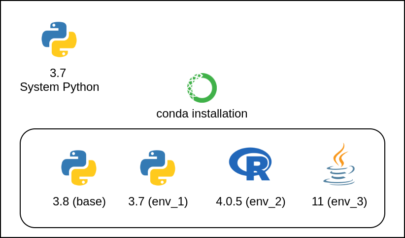
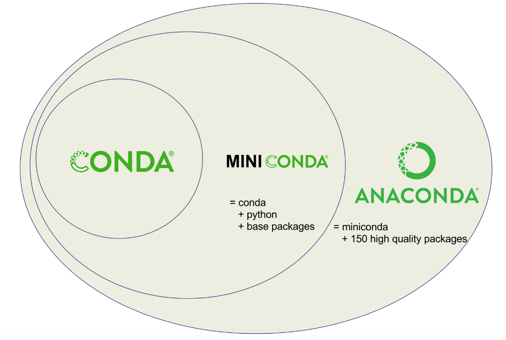
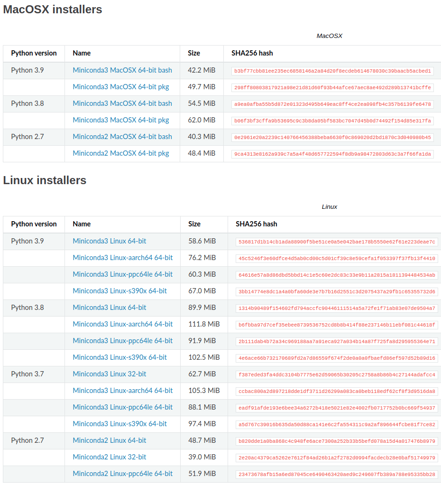
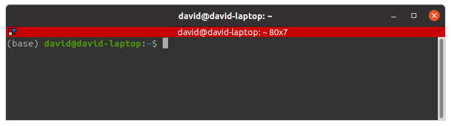
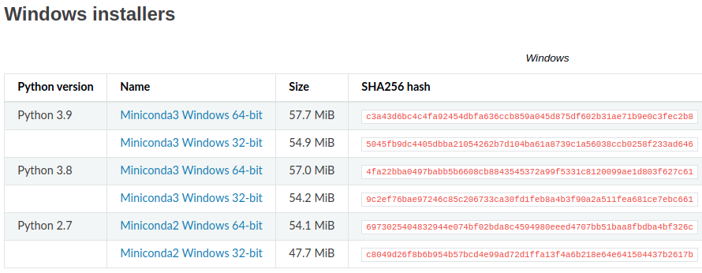
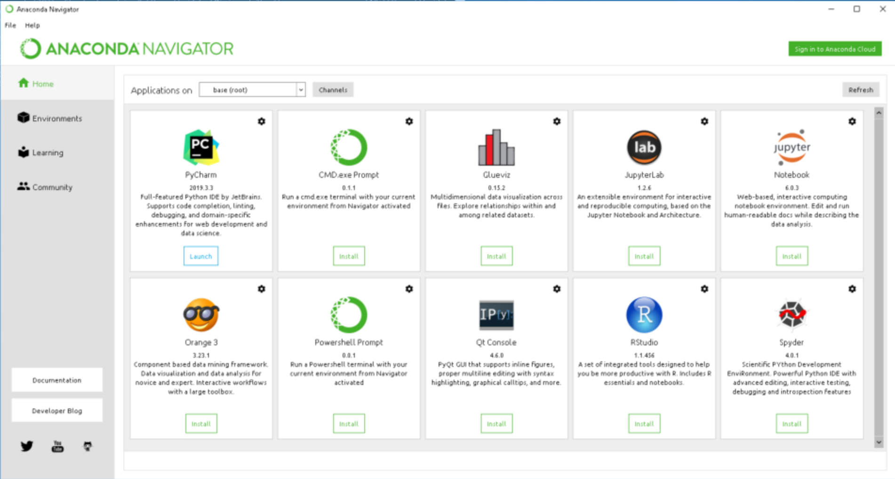
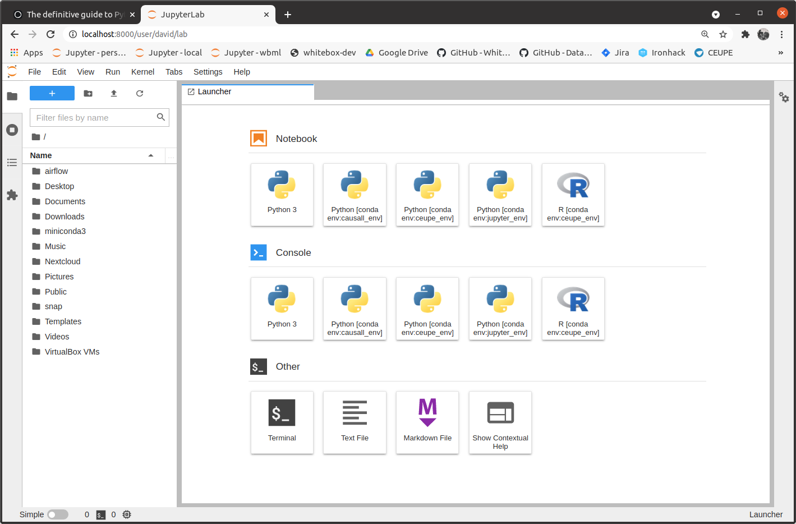
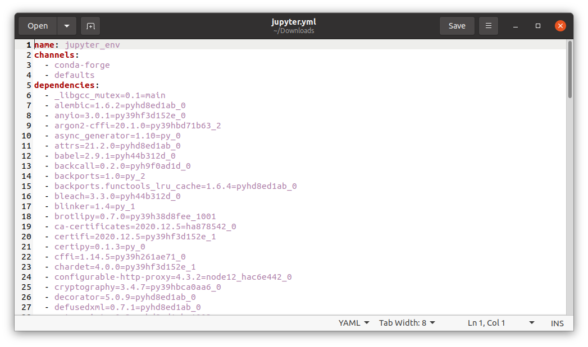

> There are two types of Data Scientists, those who took the time to master conda and those who don't (and cry at the corners because of that).

This is the first post of the [WhiteBox](https://whiteboxml.com) toolkit series, where we will tell you more about the tools we use in our everyday job, in high detail.

This post is about **conda**, the tool we use to install and manage Python and its libraries in our systems. We use it for both development and production purposes and we strongly believe that conda stands out from other alternatives like virtualenv, poetry, pyenv or pipenv.

We don't use conda because of habit. We also tried other alternatives and always go back to conda because it is the only, let's say, full featured solution on the market.

Based on my experience of more than 6 years doing Data Science, conda (and virtual environments in general) is a tool that is often not well understood. You would be surprised how many excellent professionals, even with 5+ years of experience still struggle with chaotic, corrupted, and barely usable Python installations because of that.

The goal of this post is to **end this madness once for all**. If you get a better understanding of virtual environments we have accomplished our goal.

")

## 1. Virtual environments

First, let's dive into **what a virtual environment is and what it isn't** with some examples.

### 1.1 Use cases

Imagine you want to start a new Data Science project. You want to:

- Load some data from a .csv file.
- Make some transformations (clean, aggregate, etc.).
- Train a Machine Learning model.

To do that, you want to use Python (or R), with some libraries. In the case of Python, you need:

- Python itself
- pandas
- scikit-learn

In the case of most UNIX-like operating systems (Linux distributions, and macOS) Python is already shipped with the Operating System out of the box. Just open a terminal and write: `which python3`.


As you can see, the output of this command says that Python is already installed in our system, specifically in the location `/usr/bin/python3`. Python is just an executable binary in our system.

This Python installation is called System Python, and it means that this executable is used by our Operating System to do many things. For example, if you open a file explorer, it may use System Python under the hood to list files and folders. That's the reason we want to preserve this Python installation clean and working perfectly.

If during the process of installing libraries (like pandas or scikit-learn) System Python breaks (and believe me, shit happens), the probabilities of being in trouble (complicated fix / fresh OS install) are high, that's one of the reasons virtual environments exist and are so popular.

Now imagine that you want to install the latest version of Apache Airflow (a Python library for orchestrating workflows) using Python version 3.8, but your system runs Python 3.7. In that case, virtual environments are also your best friend.

Typical usages for virtual environments are:

- You can experiment with them without fear. Install and uninstall libraries, and if something breaks, you can just delete the environment and create it again without risk.
- You can create as many virtual environments as you need. For example, one virtual environment for every project, or a virtual environment for every application you want to run isolated from the rest of your system (Jupyter, Apache Airflow, etc.).
- Some libraries may have conflicting requirements (for example, a library needs Python 3.6 while other legacy unmaintained library still needs Python 2.7) and can be installed in different virtual environments.

### 1.2 Definition

A virtual environment is just an **isolated installation of Python and its libraries**. In the next sections of this post, I will explain that a virtual environment is not limited to Python, but any arbitrary software.



For example, in the diagram above we have:

- A System Python (3.7 version).
- A conda installation with 4 virtual environments, 2 Python, 1 R, 1 Java.

We will go deeper into what this diagram means, but for now, you should have basic understanding about what is a virtual environment.

In the case of using conda for creating and managing our virtual environments, these are fully independent, which means they don't relate with the System Python or to each other. Other virtual environment managers do not respect this independence and create links to System Python, limiting your choices of Python versions.

## 2. Mythbusters

If you are reading this post and you probably have some previous knowledge about virtual environments (or at least, you think you have), so let's start fighting some hoaxes about virtual environments and conda you are probably familiar with.

### 2.1 conda and Anaconda (or Miniconda) are the same thing: **False**

**conda** is a virtual environment manager, a software that allows you to create, removing or packaging virtual environments as well as installing software, while Anaconda (and Miniconda) includes conda along with some **pre-downloaded libraries**. In the case of Miniconda, just the necessary libraries to just work, and in the case of Anaconda, more than 500 Mb of libraries. Take a look at the diagram below.



At this point, the inexperienced user would think: "OK, let's install Anaconda (instead of Miniconda) otherwise I will lose access to some libraries". Well... that's simply **not true**. Go to the next section for more information.

### 2.2 You must install Anaconda instead of Miniconda to have access to more libraries: **False**

The only difference between Anaconda and Miniconda is that Anaconda has lots of libraries **pre-downloaded** so when you do `conda install pandas` it is already downloaded from the internet and ready to install.

This is **not** a huge advantage over Miniconda:

- Nowadays, most workstations and servers have access to a fast internet connection. When you try to install a new library conda first check if it is already downloaded/cached in your system, and if not, downloads it from the internet.
- In addition, library versions are updated constantly, so the 500 Mb of cached libraries of Anaconda will be outdated in probably a few hours.
- Of all libraries pre-installed with Anaconda, you probably only need a fraction to start working on your project.

To make it clear: **the available library catalog is the same for Anaconda and Miniconda**, and there is no advantage of installing Anaconda over Miniconda (unless you want to lose 500 Mb of storage in your hard drive). Just install Miniconda and let conda (remember, the virtual environment manager) download and install the last version of packages from the internet as needed.

### 2.3 You can use conda or pip, but not both: **False**

There is an extended belief that conda and pip are alternatives or competitors, and that's not true. conda and pip do not have the same goal, and they work pretty well together!

Remember from the beginning of this post that conda is a virtual environment manager, a software that does two things:

1. Manages virtual environments: it creates, deletes, or packages virtual environments.
2. Install libraries from conda repositories (also called channels): it allows to install software inside a virtual environment. This software includes entire programming languages like Python, R, or Java, libraries like pandas or scikit-learn, or even software like htop, tmux or a full fledged PostgreSQL database.

The only point where conda and pip are competitors is a subset of the #2 point: installing Python libraries. When you create a new virtual environment, you can install Python libraries using both conda or pip. Most of the time there is no difference in installing them with conda or pip. The pip catalog is more complete, while the conda dependency resolver is more robust. Inside a conda virtual environment, you have access to both conda **and** pip to install libraries.

### 2.4 conda is for Python virtual environments only: **False**

This is one of the less known _features_ of conda virtual environments that make it stand out from the competition.

Most people think that conda is for Python, but the reality is that a conda virtual environment is a generic environment where you can install almost anything. Need R and RStudio? You got it. Need Java? Need a database? You got it. You can even install some libraries you would traditionally install using `apt` or `brew`, like htop or tmux.

### 2.5 venv is just like conda, but lightweight: **False**

venv and conda differ in two main points:

- conda is more than a Python virtual environment manager. It is a generic virtual environment that supports much more than Python. Python installed in a conda environment is a **real Python executable**, not a link to your System Python (as is the case in other alternatives), so its version can be whatever you want, is not constrained by the System Python.
- venv is limited to installing packages using pip, while using conda you have both pip and conda package installer available.

## 3. conda installation

### 3.1 Linux and MacOS

If you are using Linux or MacOS, the procedure is very similar. Follow these steps carefully (do not skip anything) to avoid post-installation problems:



1. Go to: [https://docs.conda.io/en/latest/miniconda.html](https://docs.conda.io/en/latest/miniconda.html).
2. Download the latest version for Linux or MacOS. My recommendation is to use the bash installer (`.sh` file). In the case of MacOS, you have also the option of a graphical installer (`.pkg`). To download, just click the link, and if you do not have access to a graphical interface, just use `wget`. Download **the latest version**. Do not worry about having Python 3.9 if you need Python 3.7. This is just the Python version of the `(base)` environment, the one that conda uses internally, but not the version of the Python of your virtual environments (you can choose the version you want).
3. Execute the bash installer from the terminal (it is just a bash script): `bash Miniconda3-py39_4.9.2-Linux-x86_64.sh`.
4. Hit `Enter` to read the T&C sections of the installation until the installer asks you for a `yes/no` answer. Answer `yes`.
5. Now the installer is asking for an installation location. My recommendation is: keep the default location: `/home/<your_user>/miniconda3`.
6. Now the installer will ask you if you want to initialize conda. **Answer yes** (be careful because the default answer is set to no). Initializing conda you have access to conda from your standard terminal every time you open it. If you do not initialize conda, you may not have access to `conda` (the conda executable will not be on your PATH) when you open a terminal.
7. Close the terminal.

Finally, you can check that conda is properly installed this way:

1. Open a **new** terminal.
2. You should see a `(base)` in your prompt. It means that conda is properly installed and initialized, and a default environment called base is activated.
3. Write `conda` in your terminal. You should see the conda help.
4. Write `conda info` in your terminal. You should see details about your current conda installation.




### 3.2 Windows



If you are using Windows, the installer is just a standard graphical installer.

**Warning: Windows is not the standard**

I must warn you that Windows is not the standard to develop Data Science projects (and most software development tasks), so you can expect lots of things to not work as smoothly as on Linux. You're warned! If you are interested in setting up a professional development environment for Data Science projects, check [this post](/blog/definitive-data-scientist-setup/).

1. Go to: [https://docs.conda.io/en/latest/miniconda.html](https://docs.conda.io/en/latest/miniconda.html).
2. Download the latest version for Windows. Make sure you download **the latest Python version**. Do not worry about having Python 3.9 if you need Python 3.7 or 3.8. This is just the Python version of the `base` environment, the one that conda uses internally, but not the version of the Python of your virtual environments (you can choose the version you want).
3. Execute the installer (`.exe`).
4. Click `Next >` until you are asked to select the scope of the installation. Select the `Just Me` option. You don't need to install conda for all users most of the time (which requires admin privileges) but just for you.
5. Now the installer is asking for an installation location. My recommendation is: keep the default location: `C:\Users\<your_user>\miniconda3`.
6. Now the installer will ask you to set the advanced options. **Do not add conda to the PATH environment variable in Windows**, as things work differently than other OS and you will use a special terminal to access conda.

")

")

")

Finally, you can check that conda is properly installed this way:

")

1. Open the Start Menu of Windows and look for an application called Anaconda Prompt. Open it.
2. Write `conda` in the Anaconda Prompt terminal. You should see the conda help.
3. Write `conda info` in your terminal. You should see details about your current conda installation.

## 4. Virtual environments management

In this section, I will teach you the **best practices** for managing virtual environments.

**Warning: avoid Anaconda Navigator**



There is a very popular (especially in Windows) tool which is just a front to the conda CLI tool. This graphical tool doesn't work pretty well, and unless it improved dramatically in recent times, I have discouraged you from using it, as it is responsible for many broken environments. **Stick to the CLI for managing your conda environments**.

### 4.1 The base environment

During conda install, a default virtual environment called base is created. This environment is used internally by conda to work. conda itself is installed in that environment like a library. Although you can use that environment to install libraries, my recommendation is that you don't. Don't mess with the base environment.

### 4.2 Creating a new virtual environment

To create a virtual environment, just do:

```bash
conda create -n <environment_name>
```

And confirm you want to create the environment with `y` (yes).

This will create an **empty** virtual environment. Empty is bold and underlined because I mean it. It is empty. There is nothing installed in this environment, and yeah, that means Python is not installed in that environment too.

**Warning: do not run `pip install` commands in an empty environment**

When you create an empty virtual environment, as there is no Python installed on that environment nor pip, when you run a `pip install` command, you are probably installing that library in the System Python (terrible) or the base environment (not so terrible, but not good either).

**Info: virtual environments live physically inside folders**

conda virtual environments created by the user (the exception is the base environment) are physically located in folders in the path (for Linux / MacOS):

- `/home/<your_user>/miniconda3/envs/<environment_name>`

Now you have created your first virtual environment, let's move to the next step... activating it.

### 4.3 Activating and deactivating a virtual environment

To activate a virtual environment use, the `activate` command:

```bash
conda activate <environment_name>
```

Activating an environment means that all environment actions you perform from the activation moment onward will be performed on the active environment.

You can check the active environment two ways:

- Checking the modified prompt, as the name of the active environment will appear inside parentheses:


- Checking the output of the command: `conda env list`:


To deactivate a virtual environment, use the `deactivate` command:

```bash
conda deactivate
```

The modified prompt will show the name of the previously active environment (normally, the base environment).

**Warning: avoid stacking environments**

You must be very careful activating environments and always **must remember to deactivate an environment once you are not going to use it** because environments can be **stacked**. It means that you can activate an environment on top of another environment. This behavior (which is useful in very specific situations) will lead to chaos in a short amount of time: the libraries installed in the environments will be mixed and you will have no idea where they are installed.

Now that you know how to activate and deactivate environments, let's move to the next step... installing Python in an empty environment.

### 4.4 Installing Python in a virtual environment

Remember that virtual environments are empty when you create them. In case you need a Python virtual environment, your first task is installing Python in that empty virtual environment.

To install Python in an empty virtual environment, run the command (do not forget to activate the environment first):

```bash
conda install python
```

This command will install the latest version of Python available in the conda repositories (at the time of writing this post the latest version is 3.9). If you need an older version of Python, you can just specify it in the command:

```bash
conda install python=3.8
```

**Warning: latest Python version**

Be careful installing the last version of Python. Most libraries take months to adapt to a new Python version and will not work properly with the latest. I usually stick to a bit older (1-2 releases behind) version of all my projects.

Now that you have a working virtual environment with Python installed, let's move to the next step... installing extra libraries.

### 4.5 Installing R in a virtual environment

In case you need R in your virtual environment, run the following command instead of the previous one:

```bash
conda install r-essentials
```

This command will install R along with some _essential_ R packages.

### 4.6 Installing libraries

#### 4.6.1 Installing from conda or pip

To install a library in a conda virtual environment, you will normally run the command:

```bash
conda install <library_name>
```

If you need a specific version of a library, just specify it:

```bash
conda install tensorflow=2.4.1
```

Remember that using the native conda install command, you can not only install Python libraries but much other software:

- A process viewer: `conda install htop`.
- A terminal multiplexer: `conda install tmux`.
- Postgres: `conda install postgresql`.
- And many others...

Only for Python libraries, and if you have Python installed in the virtual environment, you can use pip to install libraries, for example:

```bash
pip install <library_name>
```

If you need a specific version, specify it like this:

```bash
pip install tensorflow==2.4.1
```

#### 4.6.2 conda channels

The software repositories from conda are called _channels_. A channel is like a folder and it contains multiple libraries. The most important channels are:

- anaconda (default): the default conda channel, called anaconda is the more stable one, and where the most trusted software lives. If you do not specify a channel, conda will look in this channel for libraries.
- conda-forge: community-driven channel with the latest version of libraries. If you need a library that is not in the default channel you can probably find it here.

Everyone can have their conda channel. Many companies have their conda channels where they upload software. For example, Intel has its conda channel with libraries optimized to run in Intel hardware: [https://anaconda.org/intel/repo](https://anaconda.org/intel/repo)

When you install Python in an empty environment, you are downloading and installing Python from the default anaconda channel without even noticing it.

If you need to install a library from a specific channel, use the argument `-c` followed by the name of the channel, like this:

```bash
conda install -c <channel_name> <library_name>
```

For example, to install the graphing library Plotly from the Plotly official channel:

```bash
conda install -c plotly plotly
```

To search for a library in a conda channel, you can use the `search` command:

```bash
conda search -c <channel_name> <library_name>
```

This command returns all available versions of the library with its corresponding builds.


Now, let's go with some common libraries and packages you may want to install in your conda virtual environment and are a bit tricky...

#### 4.6.3 Installing Jupyter



To install the latest Jupyter version in a virtual environment:

```bash
conda install -c conda-forge jupyterhub jupyterlab nodejs nb_conda_kernels
```

This installation includes the new front-end (JupyterLab) along with other tools to allow authentication (JupyterHub), installing extensions (Node.js), and an automatic kernel discovery library (nb\_conda\_kernels).

#### 4.6.4 Installing Spark

To install Spark in a virtual environment:

```bash
conda install -c conda-forge openjdk pyspark
```

This installation includes Spark (with PySpark) as well as the Java Virtual Machine (needed by Spark to run).

#### 4.6.5 Installing Tensorflow with GPU support

```bash
conda install -c conda-forge tensorflow-gpu
```

This installation will work if you have NVIDIA drivers properly installed. It will set the rest of the NVIDIA stuff for you (CUDA, cuDNN, etc.).

### 4.7 Listing installed libraries

To get the full list of the software installed in a conda virtual environment, use the `list` command (remember to activate the desired virtual environment previously):

```bash
conda list
```


### 4.8 Deleting a virtual environment

The best thing about virtual environments is that when you no longer need them, or something goes wrong and breaks, you can always delete it and re-create it from zero.

To delete a conda virtual environment use the `remove` command:

```bash
conda env remove -n <environment_name>
```

During its normal operation, conda caches libraries used in the environments so it does not have to download it in case some library is needed in another environment. It allows conda to save some disk.

After deleting an environment, some libraries are still cached but no longer needed. You can clean your conda cache and free some precious GB of your brand new SSD with the `clean` command:

```bash
conda clean --all
```

## 5. Virtual environments sharing and packaging

This section details two ways to share and distribute a conda environment, each one with its advantages and drawbacks.

### 5.1 Sharing conda environment as a YAML file

One interesting choice to share an environment is encoding it as a `.yml` file. To create a YAML file from an existing environment, run the `export` command:

```bash
conda env export >> environment_file.yml
```



You can also create a YAML file manually, like this one:

```yaml
name: <environment_name>
channels:
  - conda-forge
  - defaults
dependencies:
  - python=3.8
  - pip
  - pandas
  - matplotlib
  - scikit-learn
  - pip:
    - lightgbm
```

Note that you can specify both packages from conda channels or pip.

To create a conda environment from a YAML file, run the `create` command with the following syntax:

```bash
conda env create -f environment.yml
```

### 5.2 Packaging a conda environment with `conda-pack`

A superb feature of conda which has no parallel among competitors is conda-pack. Using this feature at [WhiteBox](https://whiteboxml.com) we have deployed our projects in extremely hostile environments like Hadoop clusters of big corporations with extreme security measures and isolated from the internet.

`conda-pack` is a library that allows you to package your entire environment as a compressed file (a tar.gz) you can just copy and paste somewhere, and it just works.

1. Install `conda-pack`: conda creators recommend installing this library in the base environment, where you can run `conda install -c conda-forge conda-pack`.
2. Activate the desired environment: `conda activate environment_name`.
3. Place yourself in the path you want to generate the compressed file: `cd path/to/desired/directory`.
4. Pack your environment: `conda pack`. It can take some minutes depending on the size of the environment and the number of libraries installed.
5. Move the compressed file to the destination (for example, via ssh).
6. Create a folder for the environment: `mkdir environment_folder`.
7. Uncompress the environment in the folder: `tar xzvf <environment_name>.tar.gz -C environment_folder`.
8. Activate the environment: `source environment_folder/bin/activate`.
9. Run `conda-unpack` to re-create symlinks and set everything up.
10. You're done!

## 6. Final words on virtual environments

I hope that with the help of this post you gained a more profound understanding of virtual environments and never get stuck again between broken libraries.

If you miss something, or find some section confusing, please let us know so we can improve this post.

In case you are interested in a full Data Scientist setup we have been using for years in lots of projects, the one described in this post is battle-tested:

- [The Definitive Data Scientist Environment Setup](/blog/definitive-data-scientist-setup/)
