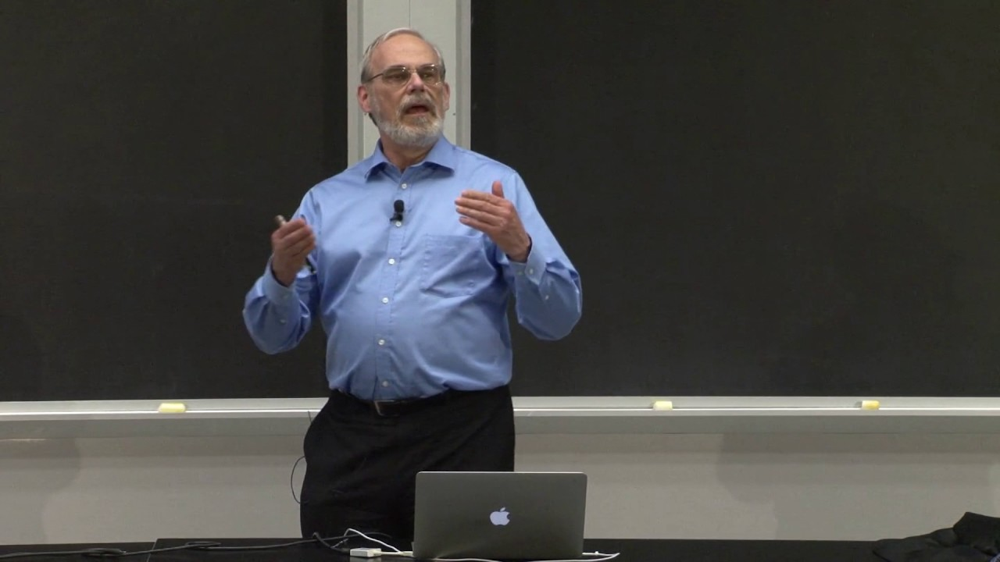
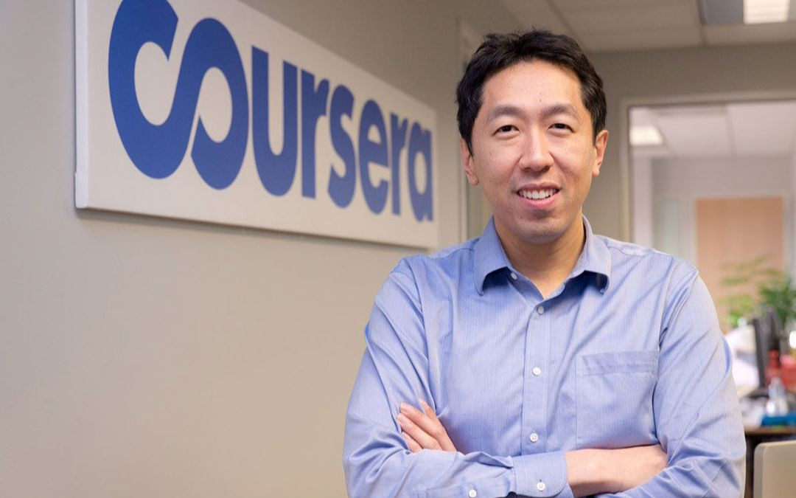
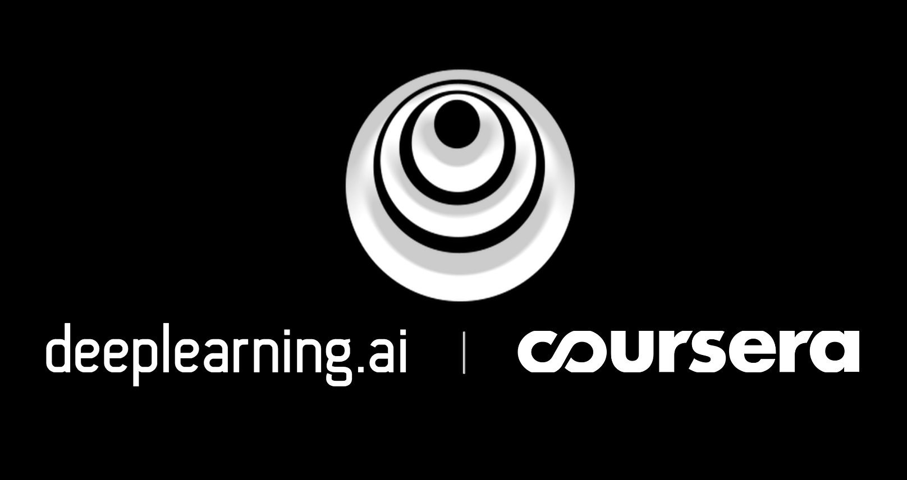

## Some context, once upon a time...

I started in Data Science back in 2015. It was not an intended move but the answer to the needs of my employer. I was working for a company providing automation services to Spanish corporations and we had the need to leverage data to **automate complex tasks whose rules could not be easily hard-coded**. I had recently graduated as an engineer in the middle of a terrible economic crisis, had some statistical modeling knowledge and was proficient using MATLAB.

In 2015 there was not specialized Data Science degrees or [boot-camps](https://www.ironhack.com/en/data-analytics) to jump-start in the field (at least, in Spain) and the naturally closest studies you could have were, in this order: Mathematics (in Spain with a strong focus in becoming a teacher/professor in the public education system) or Software Engineer (most of them more interested in App Development or creating the new Uber of "X" than in boring Data Science stuff back then).

With this context, most of Data Science practitioners were a bunch of recently graduates from mostly quantitative degrees (lots of engineers from diverse branches, and people from economics and similar degrees). In this context I found some precious online resources which helped me back then and, in the long run, made me a better Data Scientist today (2020).

## Disclaimer: online courses will not make you a Data Scientist

To become a Data Scientist you need a combination of things like:

-   A quantitative degree (not strictly mandatory, but helps).
-   Practical knowledge about the tools and technologies used. This is something you can get in a specialized boot-camp like the one [me](https://www.linkedin.com/in/davidadrian/) and [Pedro](https://www.linkedin.com/in/pedro-munoz-botas/) teach.
-   Practical experience on real-world and relevant projects. This is the most important point of this list and the hardest thing to get.
-   Being surrounded by excellent professionals. As my old boss used to tell me: if you are the smartest guy in the room, you should start worrying.
-   **A good understanding of how Data Science works, including a theoretical knowledge of how data structures, systems and algorithms work under the hood.**

This last bullet point is the focus of this post. The online courses I am going to present you here are those focused in getting the theoretical foundations of Data Science. Those courses have some common features:

-   Are **not** the typical DataCamp nano-course you can complete in an hour while commuting. Those are long, hard courses you have to invest time in.
-   Are taught by **excellent professors** from top universities.
-   Are **very valued** in the sector, by companies, recruiters etc.

Those courses are not going to make you a Data Scientist, but while you practice your skills with real-world projects, learn the tools needed, etc., those courses will set the foundations for your success as a Data Scientist in the long run, and will set you apart from mediocre Data Scientists who train Machine Learning models and write code but have no idea about what is really happening and why.

## This post is not sponsored by any of those courses

This is important to bear in mind. As opposite to other posts and listings recommending Data Science courses, this one have two advantages for you:

-   I have done each course listed here and my reason to recommend them is they are worthy based on my personal experience. I will attach the corresponding certification for every course to prove my words.
-   None of the courses authors are sponsoring me to list their content here obviously.

## The courses

Let's start, in chronological order...

### [1. Introduction to Computer Science and Programming Using Python](https://www.edx.org/course/introduction-to-computer-science-and-programming-7)

This is a **truly excellent** course by professor Eric Grimson from MIT. As I had some MATLAB experience one of my first goals as a Data Scientist was learning Python. When I took the course, the content was made for Python 2, but it has been recently updated to Python 3.

The interesting thing about this course is that it introduces important concepts about Computer Science that are usually set aside by many Data Scientists, for example:

-   Data Structures
-   Computational Complexity (Big O notation)
-   Object Oriented Programming
-   Algorithms
-   Recursion

If you are an experienced Data Scientist with no Python knowledge, should consider taking this course as it is now the standard.

[My certificate of completion](https://courses.edx.org/certificates/b2cdc2a2bc8f4774a4d1cdca61a5a81b).

### [2. Introduction to Computational Thinking and Data Science](https://www.edx.org/course/introduction-to-computational-thinking-and-data-4)

This is the second part of the previous course. It has a strong focus on **programming applied to statistics**. You can expect coding lots of **simulations**. Lots of fun.

[My certificate of completion](https://courses.edx.org/certificates/705c792d66494fc0ad27c451cb691ca6).

### [3. **The Analytics Edge**](https://www.edx.org/course/the-analytics-edge)

This is a good course by professor Dimitris Bertsimas. It focuses on a mix of **Machine Learning** and optimization **algorithms** with some **visualization** using `ggplot`. Course content includes:

-   Linear Models
-   Decision Trees
-   Random Forest
-   Clustering (k-means)
-   Linear Programming
-   Some NLP (a bit outdated nowadays)

All content is taught in R language.

[My certificate of completion](https://courses.edx.org/certificates/35bb4da1cf61463abb62a6ef67f83472).

### [4. Machine Learning](https://www.coursera.org/learn/machine-learning)

No introduction needed for this course. This is probably **the most famous course about Machine Learning** and a big contributor to the hype about ML over the last years.

This course is taught by the **famous professor and AI advocate Andrew Ng, from Stanford University**. The course is **excellent** and focuses on explaining most popular Machine Learning algorithms, including its **math foundations**.

This is one of the most valued courses in the field.

Back in 2016, this course was taught in MATLAB/Octave. I read recently that they are working on an update from MATLAB to Python, but this update has not been released yet.

[My certificate of completion](https://www.coursera.org/account/accomplishments/verify/8Y4PSZDQJ939).

### [5. Learning From Data](https://www.edx.org/course/learning-from-data-introductory-machine-learning)

This **interesting** course by professor Yaser S. Abu-Mostafa from Caltech goes very deep into **what** statistical learning is, **why** it is feasible and **how** to do it the right way, covering in depth aspects like bias-variance trade-off, overfitting, regularization, validation, theory of generalization, etc.

It explains the foundations of Machine Learning in a theoretical and rigorous manner, not recommended for those without a mathematical background.

Its contents are based on the eponymous [book](https://www.amazon.com/Learning-Data-Yaser-S-Abu-Mostafa/dp/1600490069):

")

[My certificate of completion](https://courses.edx.org/certificates/66eaf815c70b44bdbc4c54b9a06170f8).

### [6. Deep Learning Specialization](https://www.coursera.org/specializations/deep-learning)

This is the **famous** Deep Learning Specialization by Professor Andrew Ng and his new educational venture, [**deeplearning.ai**](https://www.deeplearning.ai/), and one of the most valued certificates in the field today.

This is a **long** specialization of 5 courses focused on Neural Networks, one of the most important algorithms nowadays, and the best to work with unstructured data (images, sound, text, video, etc.).

It goes from the **foundations** and **math** behind Neural Networks in the first course to **hyper-parameters tuning**, **project planning and strategy**, **convolutional architectures** and, finally, **sequence models** architectures.

The courses are highly structured, rigorous and foundational, as well as practical, with lots of real use cases.

[My certificate of completion](https://www.coursera.org/account/accomplishments/specialization/8DWTESSP5KKT).

**These are the top quality courses I recommend you.**

Nevertheless, they are not the only courses I have done since I started in this field. I am always taking some kind of course, sometimes even two at the same time; most of them  are about Data Science, although I sometimes broaden my knowledge about other topics as well such as Urban Design, Energy, among others. Maybe I will cover this topic in another post if there is interest.

You can check the full list of courses I have completed [in my LinkedIn profile](https://www.linkedin.com/in/davidadrian/).

## Honorable mentions

There are some courses that does not qualify to be in the section above but worth mentioning...

### [1. Introduction to Deep Learning](https://www.coursera.org/learn/intro-to-deep-learning)

This is a course at the Higher School of Economics of Moscow. Is not listed above because it is very broad and not very structured, but being broad can also be one of its advantages.

If you are looking for a _short_ introduction to Deep Learning which covers lots of architectures without paying too much attention to the math behind it, and don't want to spend some months going through the full Deep Learning specialization from deeplearning.ai, this is your course.

The final project is building an application able to generate captions for images, very interesting and fun.

[My certificate of completion](https://www.coursera.org/account/accomplishments/records/RCHCYKVMUMNV).

### [2. How to Win a Data Science Competition: Learn from Top Kagglers](https://www.coursera.org/learn/competitive-data-science)

This is a **different** course of Machine Learning. If I could only take a single course about Machine Learning in my life and had to choose one, I'd choose this one.

This course comprises an overview of almost all you must know to be an **efficient** Data Scientist, covering important topics like:

-   Exploratory Data Analysis.
-   Lots of different ML algorithms, from a practical point of view (when, and why you should choose one above other for a specific task).
-   Techniques like Mean/Target Encoding.
-   Lots of real examples from Kaggle competitions, explained by competition winners and Kaggle Grandmasters like [Μαριος Μιχαηλιδης](https://www.kaggle.com/kazanova).

Although this course is focused in competitive Data Science (Kaggle competitions) which **differs from real industry Machine Learning projects** where not only getting the best score is important (but inference speed, maintenance, robustness, etc.) you can get ideas to improve your Machine Learning models.

[My certificate of completion](https://www.coursera.org/account/accomplishments/records/87SZ3NV7A77P).

### [3. AI for Medicine Specialization](https://www.coursera.org/specializations/ai-for-medicine)



This **very recent specialization** by [deeplearning.ai](https://deeplearning.ai) is about how to apply Artificial Intelligence to the Healthcare Sector.

Given the current situation of the COVID-19 outbreak, it is needless to say that public and private efforts are moving towards searching innovative solutions for this public health crises.

AI applied to Healthcare is considered nowadays a greenfield and **the most promising sector to be in the next decade** (from a Data Scientist point of view):

> AI will not replace doctors, but doctors using AI will replace those who doesn't - Andrew Ng

Over the last years, there has been considerable development of AI solutions in sectors like Marketing, Customer Management, Energy, etc., but the Healthcare Sector has always lagged behind because of reasons like:

-   Administrative barriers related to data privacy and ethical considerations.
-   Lack of interest in a fairly traditional sector where communication between physicians and technologists is not always easy.
-   Algorithm performance is so critical (people's lives are at stake) that AI implementation must be done very carefully.

This recent pandemic has changed public perception about health data usage and both governments and the public opinion are much more willing to explore the possibilities of AI in the Medicine field.

This specialization is structured in 3 courses, covering:

-   AI for Medical Diagnosis: learn how to identify diseases based, for example, on medical images.
-   AI for Medical Prognosis: learn how to predict the future health of patients.
-   AI for Medical Treatment: learn about causal inference, randomized control trials, model explainability. This is the less interesting course of the specialization, and, as it is fairly new (May 2020), there are still some bugs in the assignments.

Those courses are **not very difficult from the technical point of view**, but is a good thing that you have some previous experience as a Data Scientist if you are going to take this specialization, as it focuses on explaining **critical differences** between traditional AI and Healthcare AI. There are many differences like:

-   Specific performance metrics for Healthcare.
-   Deep Learning architectures suitable for Medical Images segmentation.
-   A strong focus on Survival Analysis.

If you **want to remain a Data Scientist** in 10 years, in a very competitive environment where general Data Science is becoming a commodity, you should take this specialization.

[My certificate of completion](https://www.coursera.org/account/accomplishments/specialization/3EXEQYHMJMWU).

Thanks for reading this post, I hope this information will help you to advance your career or learn something new.

PS: Thanks to [Miriam Cañones](https://www.linkedin.com/in/miriamcc/) for her feedback while writing this post.