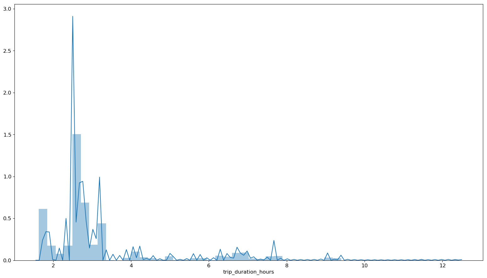
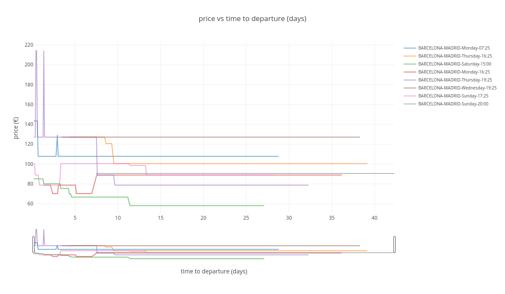
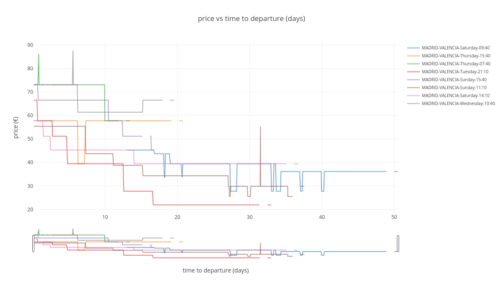
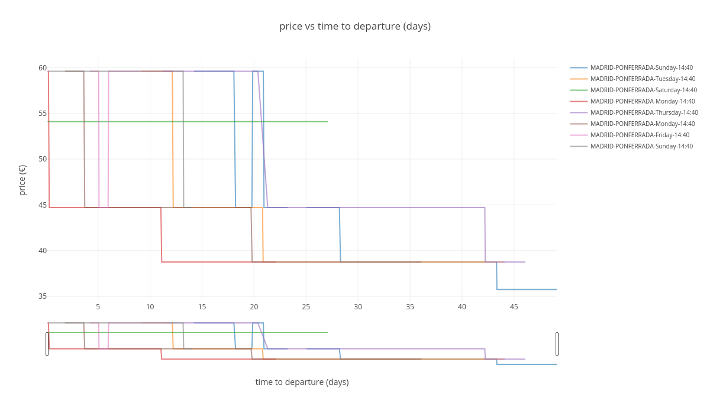

The goal if this analysis was to prove that tickets pricing varies over time, so there is a reason to create a product like [El Tren Barato](https://eltrenbarato.es), which takes advantage of this volatility in tickets pricing to offer its user the possibility get deals thanks to an alarm system.

**Is our project feasible?**

There must be strong  variations in ticket price between its release to market (about 2 months  before departure) and departure date. The goal of the project is to take advantage of those variations to send automatic reminders to users.

Let's start loading data we have been collecting for months for this goal. You can repeat this analysis as the data is available as a Kaggle Dataset [here](https://www.kaggle.com/thegurusteam/spanish-high-speed-rail-system-ticket-pricing).

## Python imports

Let's start importing some Python libraries...

```python
from IPython.display import Image
import matplotlib as mpl
import matplotlib.pyplot as plt
import numpy as np
import pandas as pd
import plotly.graph_objs as go
from plotly.offline import (download_plotlyjs, 
                            init_notebook_mode, 
                            plot, 
                            iplot)
from plotly import io as pio
import random
import seaborn as sns
```

## Settings

Now, we can set some visualization settings in order to get more beautiful plots. We will be using Plotly extensively in this post:

```python
mpl.rcParams['figure.figsize'] = (19.2, 10.8)
mpl.rcParams['figure.dpi'] = 100
mpl.rcParams['font.size'] = 12

init_notebook_mode()
```

## Data loading

Let's load scraped data. I have a dump of the full database where those trips are being inserted in `.parquet` format:

```python
renfe = pd.read_parquet('renfe.parquet')
renfe.head()
```

```text
          insert_date  origin destination          start_date            end_date train_type  price train_class  fare
0 2019-05-08 03:53:06  MADRID    VALENCIA 2019-05-21 06:45:00 2019-05-21 08:38:00        AVE  27.80     Turista Promo
1 2019-05-08 03:53:06  MADRID    VALENCIA 2019-05-21 07:40:00 2019-05-21 09:20:00        AVE  57.75     Turista Promo
2 2019-05-08 03:53:06  MADRID    VALENCIA 2019-05-21 09:10:00 2019-05-21 10:58:00        AVE  45.30     Turista Promo
3 2019-05-08 03:53:06  MADRID    VALENCIA 2019-05-21 09:40:00 2019-05-21 11:24:00        AVE  39.45     Turista Promo
4 2019-05-08 03:53:06  MADRID    VALENCIA 2019-05-21 10:40:00 2019-05-21 12:20:00        AVE  33.65     Turista Promo
```

Let's check how many trips we have in this dataset:

```python
renfe.shape
```

```text
(3398152, 9)
```

As you can see, there is 3.4M registers in this dataset.

Every register is a trip scraped in a particular time, so the same trip (defined uniquely by columns `origin`, `destination`, `start_date`, `end_date`, `train_type`) appears many times, and its particular price, fare and train class varies over time.

The intuition tells us that that as the departure time is closer, the price should be higher as the cheaper seats sold out.

Let's get some additional info about our dataset, like how much memory it takes and a summary statistics of its columns:

```python
renfe.info(memory_usage='deep')
```

```text
<class 'pandas.core.frame.DataFrame'>
Int64Index: 3398152 entries, 0 to 3398151
Data columns (total 9 columns):
insert_date    datetime64[ns]
origin         object
destination    object
start_date     datetime64[ns]
end_date       datetime64[ns]
train_type     object
price          float64
train_class    object
fare           object
dtypes: datetime64[ns](3), float64(1), object(5)
memory usage: 1.1 GB
```

```python
renfe.describe(include='all')
```

```text
              insert_date   origin destination          start_date  ...  train_type         price train_class      fare
count             3398152  3398152     3398152             3398152  ...     3398152  3.039263e+06     3381245   3381245
unique             188975        5           5               10205  ...          16           NaN           7         9
top   2019-05-17 09:00:56   MADRID      MADRID 2019-06-02 17:30:00  ...         AVE           NaN     Turista     Promo
freq                  125  1763557     1634595                2623  ...     2376340           NaN     2586178   2314165
mean                  NaN      NaN         NaN                 NaN  ...         NaN  6.327159e+01         NaN       NaN
std                   NaN      NaN         NaN                 NaN  ...         NaN  2.572818e+01         NaN       NaN
min                   NaN      NaN         NaN                 NaN  ...         NaN  1.545000e+01         NaN       NaN
25%                   NaN      NaN         NaN                 NaN  ...         NaN  4.355000e+01         NaN       NaN
50%                   NaN      NaN         NaN                 NaN  ...         NaN  6.030000e+01         NaN       NaN
75%                   NaN      NaN         NaN                 NaN  ...         NaN  7.880000e+01         NaN       NaN
max                   NaN      NaN         NaN                 NaN  ...         NaN  2.142000e+02         NaN       NaN
```

## Data wrangling

Now we have our dataset loaded, let's make some transformation needed for this analysis.

### Create trips unique id

First, let’s create a unique index for every trip. A trip id must be defined as a **‘primary key’** for a trip, resulting from combination of columns, Python `hash` stardard library function can be used to perform this task efficiently:

-   `origin`
-   `destination`
-   `start_date`
-   `end_date`
-   `train_type`

```python
renfe.loc[:,'trip_id'] = renfe_index_hash = renfe[['origin', 
                                                   'destination', 
                                                   'start_date', 
                                                   'end_date',
                                                   'train_type']] \
                                            .apply(lambda x: 
                                             hash(tuple(x.to_list())), 
                                             axis=1)
```

### Filter trains that are not high-speed

First, let's calculate trip duration:

```python
renfe.loc[:, 'trip_duration'] = renfe['end_date'] - renfe['start_date']
renfe.loc[:, 'trip_duration_hours'] = renfe['trip_duration'].dt.components.hours + \
renfe['trip_duration'].dt.components.minutes / 60
```

Now let's plot `trip_duration` distribution:

```python
sns.distplot(renfe['trip_duration_hours']);
```



Most trips that are ‘high’ speed should take far less than 4 hours. Otherwise it means that the train is not really high speed or there is a transfer involved. We are not interested in those trips, so, can set a threshold and filter any trip over that value:

```python
high_speed_max_duration = 4
renfe = renfe.loc[renfe['trip_duration_hours'] < high_speed_max_duration, :]
```

### Compute time left to train departure

We will also need a variable that represents how much time lasts to train departure from the very moment of data scrapping. This impacts heavily on price as it increases as departure is closer in time  (intuition says that is important getting tickets with enough time).

```python
renfe.loc[:,'time_to_departure'] = renfe['start_date'] - renfe['insert_date']
renfe.loc[:,'time_to_departure_days'] = renfe['time_to_departure'].dt.components.days \
                                      + renfe['time_to_departure'].dt.components.hours / 24 + \
                                        renfe['time_to_departure'].dt.components.minutes / 60 / 24
```

Negative values for `time_to_departure` must be filtered as they are probably due to errors in scrapping or Renfe webpage maintenance.

```python
renfe = renfe.loc[renfe['time_to_departure_days'] > 0, :]
```

## Price vs time left to train departure

And finally, let's answer the question using some visualizations. First, let’s make a function that plots price vs time to departure given an origin, destination, and a minimum of scrapped points to plot.

It is interesting to make it interactive, as it is expected that price changes are due to fare and train class differences, and tooltips with that information will be useful to have. Because of our publishing platform limitations, plots in this post will be static, but using this code you should be able to reproduce it easily.

```python
def plot_price_vs_time_to_departure(origin, 
                                    destination, 
                                    min_obs=256, 
                                    n_trips=8, 
                                    dynamic=False):
                                    
    trips_obs = renfe['trip_id'].value_counts()
    min_obs_filter = renfe['trip_id'] \
    .isin(trips_obs[trips_obs > min_obs] \
    .index.to_list())
    
    filter_origin_destination = (renfe['origin'] == origin) & \
    (renfe['destination'] == destination)

    traces = []

    for trip_id in random.sample(list(renfe[filter_origin_destination \
                                            & min_obs_filter].trip_id.unique()), n_trips):

        trip = renfe[renfe['trip_id'] == trip_id] \
        .drop_duplicates(subset='insert_date', 
        keep='first').sort_values('insert_date', 
        ascending=False)

#         filter_departure_filter = trip['time_to_departure_days'] >= 0.0
#         trip = trip.loc[filter_departure_filter, :]

        traces.append(go.Scatter(
                      x=trip['time_to_departure_days'],
                      y=trip['price'],
                      name = f"{origin}-{destination}-{trip['start_date'].iloc[0].strftime('%A-%H:%M')}",
                      text = trip['fare'] + \
                             '_' + trip['train_class'] + \
                             '_' + trip['train_type'],
                      hoverinfo = 'text+y+x',
                      opacity = 0.6))

    layout = dict(
        title='price vs time to departure (days)',
        xaxis=dict(title='time to departure (days)', 
                   rangeslider=dict(visible = True)),
        yaxis=dict(title='price (€)'),
        legend=dict(font=dict(size=10)),
    )

    fig = dict(data=traces, layout=layout)
    
    if dynamic:
        
        iplot(fig, filename = "price_vs_time_to_departure")
    else:
        img_bytes = pio.to_image(fig, 
                                 format='png', 
                                 width=1200, 
                                 height=700, 
                                 scale=1)
        Image(img_bytes)
        
    plot(fig, filename = f"price_vs_time_to_departure_{origin}_{destination}.html", auto_open=False)
    display(Image(img_bytes))
```

### Madrid to Barcelona route

```python
plot_price_vs_time_to_departure('BARCELONA', 
                                'MADRID', 
                                min_obs=400, 
                                n_trips=8)
```



As seen in the plot, there is a variation in price, going up and down depending on different situations. The general trend is that, the  closer the departure time is, the higher the price. Price changes  because of two reasons:

-   Cheaper tickets are sold out: it means that only more expensive  tickets are available (for example fare Promo -> Flexible, or train  class Turista -> Preferente).
-   Due to ticket cancellations or increases in train capacity (longer trains) cheaper tickets are released and price drops.

Gaps in the series means that all tickets are sold our or problems with our scrapping system (more likely the first option).

### Madrid to Sevilla route

```python
plot_price_vs_time_to_departure('MADRID', 'SEVILLA')
```


A similar behavior is shown here, maybe with more stable/predictable prices and less price drops.

### Madrid to Valencia route

```python
plot_price_vs_time_to_departure('MADRID', 'VALENCIA')
```



Same feeling here, stable/predictable prices with only a few price drops.

### Madrid to Ponferrada

```python
plot_price_vs_time_to_departure('MADRID', 'PONFERRADA')
```



I this case there is no direct High Speed Train to [Ponferrada](https://www.google.com/maps?client=ubuntu&channel=fs&q=ponferrada&oe=utf-8&um=1&ie=UTF-8&sa=X&ved=2ahUKEwjmx7vl64_oAhUE1xoKHczNBDEQ_AUoAnoECBsQBA) and a transfer is needed in León.

## Conclusions

Up to this point, data looks promising. Copying directly from our project Trello board, our idea is described as:

1.  Show tickets from Renfe and 2nd hand stores for user selected day and time period.
2.  Give the user the option to set an alarm and be notified in case ticket (second hand or Renfe) experiment a price drop (only drops, not rises).
3.  In case there is no options available, set up an alarm when the new ticket is released.